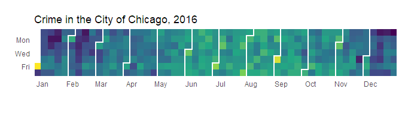

CalendRplot
================
Andrew Coleman
November 24, 2018

## CalendRplot

Package for creating calendar heatmaps in R using `ggplot2`

**This package is currently under development. Features may work
incorrectly or not at all.**

Presently, the objective is to create a package which exports a single
function. This function’s first argument is a `data.frame`, and
subsequent arguments give the user some customization options. The
function will export a `ggplot` object, which the user can then either
further customize or add additional geoms to.

## Example: Chicago Crime Statistics

In this example, we use data from the Chicago Police Department on
reported incidents of crime in the City of Chicago from 2001 to present,
which you can export in csv format
[here](https://data.cityofchicago.org/Public-Safety/Crimes-2001-to-present/ijzp-q8t2).
Please note that the full file is over 1GB in size.

A small amount of pre-processing is necessary before the data provided
by the Chicago Police Department is ready to visualize. First, there is
a column named `Date` that contains date-time information (in character
form). We will first rename this column as `Datetime`, to more
accurately reflect its contents. Then we will create a column named
`Date` to store the date extracted from the `Datetime` column. Following
that, we select only those rows that are during the years 2013 to 2017,
and those crimes which are violent.

``` r
library(CalendRplot)
library(data.table)
library(stringr)
library(ggplot2)

chi.data <-
  fread('ignore_data/Crimes_-_2001_to_present.csv')

setnames(chi.data, 'Date', 'Datetime')

chi.data[, Date := as.Date(str_extract(Datetime, '^[0-9]{2}/[0-9]{2}/[0-9]{4}'), 
                           format = '%m/%d/%Y')]

chi.crime <-  
  chi.data[Date >= as.Date('2013-01-01') 
           & Date < as.Date('2018-01-01') 
           & `Primary Type` %in% c('ROBBERY', 'DOMESTIC VIOLENCE', 'ASSAULT',
                                   'CRIM SEXUAL ASSAULT', 'BATTERY', 'HOMICIDE'),
           .(`Number of Crimes` = .N),
           keyby = .(Date)]
```

Let’s take a quick look at the contents of the `chi.crime` variable that
was created in the last command of the previous code block.

``` r
chi.crime
```

    ##             Date Number of Crimes
    ##    1: 2013-01-01              395
    ##    2: 2013-01-02              157
    ##    3: 2013-01-03              196
    ##    4: 2013-01-04              194
    ##    5: 2013-01-05              221
    ##   ---                            
    ## 1822: 2017-12-27              149
    ## 1823: 2017-12-28              157
    ## 1824: 2017-12-29              162
    ## 1825: 2017-12-30              198
    ## 1826: 2017-12-31              199

We see that it gives a table, with each row containing a date along with
the number of violent crimes committed in Chicago on that date.

Now we will use the `PlotCalendarHeatmap()` function, provided by this
package, to plot the `chi.crime` data.

Here, the `PlotCalendarHeatmap()` function takes as arguments a
`data.frame` type object, in this example `chi.crime`, as well as a
`character` type object indicating which column contains the date
information, and a second `character` type object which indicates which
column contains the information to be used to determine the fill color
for each day. The function then returns a `ggplot` object, which is then
modified by the `scale_fill_viridis_c()` function (which alters the
color gradient and legend), and the `labs()` function (which gives the
plot its title).

``` r
CalendRplot::PlotCalendarHeatmap(data = chi.crime,
                                 date.column = 'Date',
                                 fill = 'Number of Crimes') + 
      ggplot2::scale_fill_viridis_c(
      limits = c(75, chi.crime[,max(`Number of Crimes`)]*1.05),
       trans = 'identity',
      option = 'magma',
        name = 'Number of Crimes',
       guide = ggplot2::guide_colorbar(title = 'Number of Crimes',
                               nbin = 80,
                          barheight = grid::unit(    x = 0.25,
                                                 units = 'npc'),
                              draw.ulim = TRUE,
                              draw.llim = TRUE,
                              frame.colour = 'grey50',
                              ticks.colour = 'grey50')) + 
  ggplot2::labs(title = 'Violent Crime in the City of Chicago, 2013-2017')
```

    ## Scale for 'fill' is already present. Adding another scale for 'fill',
    ## which will replace the existing scale.

<!-- -->

The graphic allows us to identify several potential patterns in the data
that would not be readily apparent if we were perusing the numbers in a
table. First, it appears as though violent crime is more frequent during
the summer months, as compared to the winter months. Second, weekends
appear to have higher numbers of violent crimes compared to their weeks.
Third, it looks as though some holidays may have an effect on the number
of crimes committed. In particular, New Year’s Day (January 1st) and to
a lesser extent Independence Day (July 4th, as well as the following
day, July 5th) seem to have higher rates of crime than we would
otherwise expect. Also, for each of the years, there is a weekend in
mid-March that appears to have an increased number of violent crimes,
which may coincide with the city’s annual St. Patrick’s Day festivities.

The graphic is not a means to determine whether any of the relationships
presented in the previous paragraph actually exist, but it can be a
valuable tool for determining what possible relationships could be worth
investigating with more mathematical means.

## Planned Features

The following is a list of features which are planned.

  - \[x\] Create the basic calendar heatmap

  - \[x\] Create lines to separate months

  - \[x\] When multiple years are included, `facet_grid` on years

  - \[x\] Improve function syntax, including allowing user to supply a
    `data.frame`, and then take additional arguments to identify which
    field is used for the date and which field is used for the values
    for the heatmapping

  - \[x\] Fit and finish on locations of various labels

  - \[ \] Ability for user to supply their own groupings to be used in
    facets and in drawing the monthly separations

  - \[ \] Quarterly separations?

  - \[ \] ~~Alternate separation styles? (lines, snake, alternating
    surrounding boundaries, etc)~~
