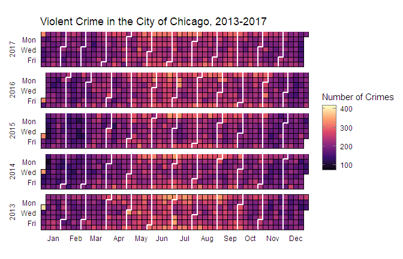

CalendRplot
================
Andrew Coleman
October 17, 2018

## CalendRplot

Package for creating calendar heatmaps in R using `ggplot2`

**This package is currently under development. Features may work
incorrectly or not at all.**

Presently, the objective is to create a package which exports a single
function. This function’s first argument is a `data.frame`, and
subsequent arguments give the user some customization options. The
function will export a `ggplot` object, which the user can then either
further customize or add additional geoms to.

## Example: Chicago Crime Statistics

``` r
chi.crime
```

    ##            date value
    ##   1: 2016-06-20   854
    ##   2: 2016-11-12   779
    ##   3: 2016-05-03   734
    ##   4: 2016-05-04   678
    ##   5: 2016-04-20   685
    ##  ---                 
    ## 362: 2016-12-27   661
    ## 363: 2016-12-28   722
    ## 364: 2016-12-29   648
    ## 365: 2016-12-30   742
    ## 366: 2016-12-31   702

``` r
CalendRplot::PlotCalendarHeatmap( chi.crime ) + 
  guides(fill = FALSE) + 
  labs(title = 'Crime in the City of Chicago, 2016')
```

<!-- -->

Here, the `PlotCalendarHeatmap()` function takes a single input,
`chi.data`, and returns a `ggplot` object, which is then modified by the
`guides()` and `labs()` functions.

This example uses data from the Chicago Police Department on reported
incidents of crime in the City of Chicago from 2001 to present, which
you can export in csv format
[here](https://data.cityofchicago.org/Public-Safety/Crimes-2001-to-present/ijzp-q8t2).
Note that the full file is over 1GB in size.

## Planned Features

The following is a list of features which are planned.

  - \[x\] Create the basic calendar heatmap
  - \[x\] Create lines to separate months
  - \[ \] When multiple years are included, `facet_grid` on years
  - \[ \] Improve function syntax, including allowing user to supply a
    `data.frame`, and then take additional arguments to identify which
    field is used for the date and which field is used for the values
    for the heatmapping
  - \[ \] Fit and finish on locations of various labels, such as the
    months
  - \[ \] Ability for user to supply their own groupings to be used in
    facets and in drawing the monthly separations
  - \[ \] Quarterly separations?
  - \[ \] Alternate separation styles? (lines, snake, alternating
    surrounding boundaries, etc)
